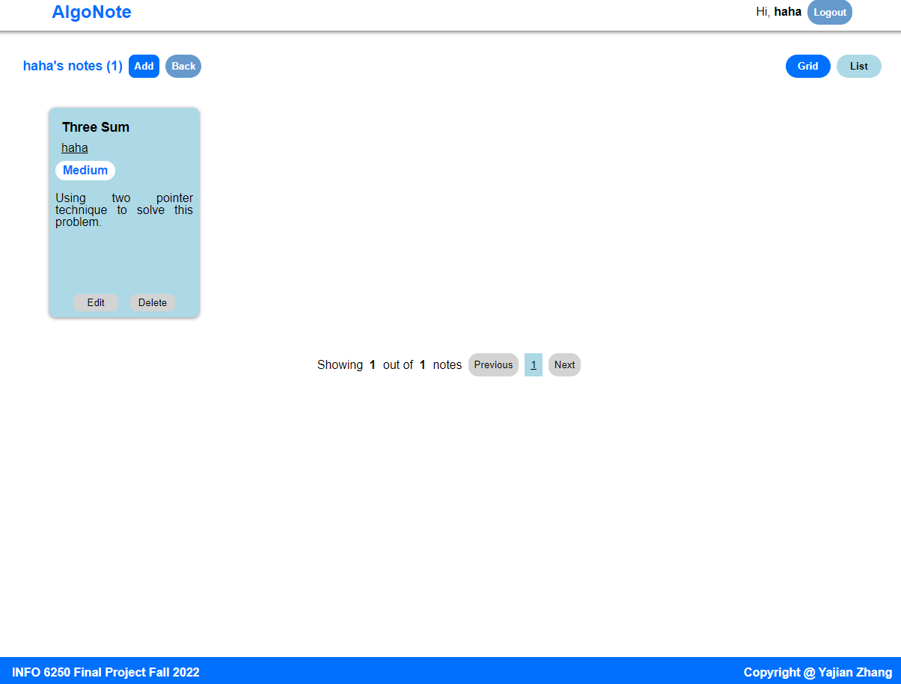

# AlgoNote

This SPA is developed using React as the frontend framework and Express as the backend framework. It allows users to take notes regarding algorithm problems and share them with others. Users can edit/delete their own notes and the 'admin' user can delete all notes. Additionally, it adopts adaptive design for screen sizes down to 360px width.

## Getting started

To start the application, pull the repository to local and run 'npm install', 'npm run build', and 'npm start'.

To continue the development, pull the repository to local and run 'npm install' and 'npm run dev'.

## Frontend

### Views

The application has five main views. When logging in, the username 'dog' will always fail because of 'wrong password'. The views are listed below.

_Login Page_
  

_Notes Page_
  

_Notes By User Page_
  

_Addnote Page_
  

_Editnote Page_
  

### Complex UI elements

The complex UI elements include Accordion, Elaborate Form(showing errors/requirements), Dramatic Adapative Changes, Pagination, etc.

### Loading indicator

You can see the loading indicators during the first render of app. To make it obvious, a 2-second timeout is setted.

## Backend

### Services

The RESTful services include checking whether a user has previously log in(session), login, get all notes, get notes by author, add a note, update a note, and delete a note. All the services are secured through a session id cookie and have different levels of authorization.

Sessions are designed to allow users to log in through multiple devices.

Polling notes (every 5 seconds) is incorporated for better user experience.

## Future improvement

This project uses the 'useContext' and 'useReducer' hooks. The state and actions are simple in the 'useReducer' hook, just checking whether a user has logged in or not and the username. Future improvements can be made to make the state and actions more complex to abstract complicated state changes.

## Image licensing

The login img comes from https://www.pexels.com/photo/white-ruled-book-351961/.
According to the Wesite's licensing term (https://www.pexels.com/license/), this image can be downloaded and userd for free.

## CSS orgination

CSS is in a semantic style, organized by the flow of page, follows the sequences:

- display
- box model
- formatting
- tyography
- transition/others
